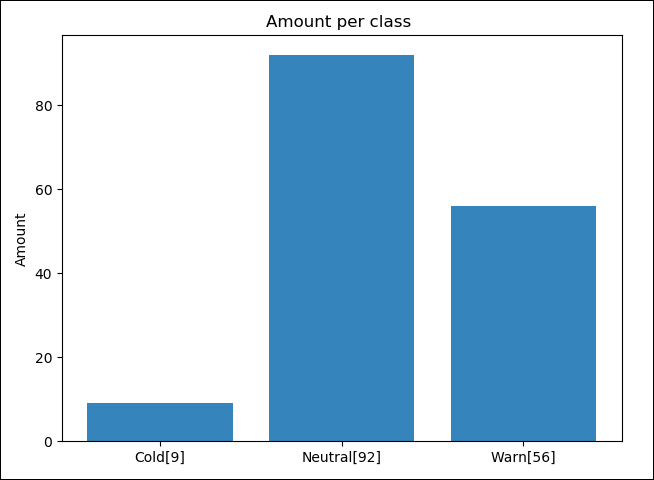
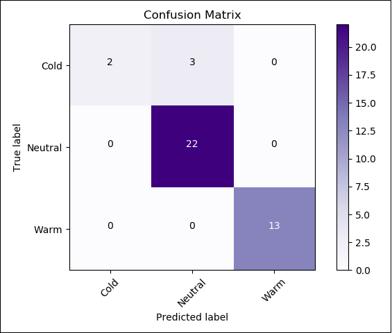
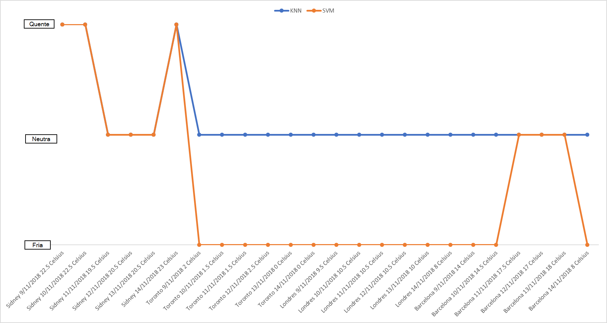

# Temperature-classifier
Foi utilizado um data-set com 157 temperaturas coletadas da cidade de Campinas (SP) do período de 01/06/2018 até 04/11/2018.
As temperaturas maiores ou iguais a 22ºC e maior foram classificadas como temperaturas quentes, já as temperaturas entre 16ºC e 22ºC foram classificadas como neutras, e por último temperaturas abaixo de 16ºC foram classificadas como frias.

## Dados utilizados para treinar o algoritmo

## Confusion Matrix Knn algorithm
* Acurácia: 89%
* Base de validação do agente: ~30% do data-set
* Neighbors: 9

## Confusion Matrix svm algorithm
* Acurácia: 92,5%
* Base de validação do agente: ~25% do data-set

## Resultados
Conforme o gráfico mostrado abaixo é possível visualizar temperaturas de outras regiões classificadas pelos modelos preditivos SVM e KNN.

Com isso conclui-se que o modelo KNN tem dificuldades em classificar temperaturas que são negativas devido ao dataset usado para treino, já que esse dataset foi baseado nas temperaturas da cidade de Campinas, que por sua vez apresentou poucas amostras de temperaturas negativas. Um outro fator é como o KNN se baseia em seus vizinhos próximos como não há muitas amostras de temperaturas negativas o mesmo acaba não encontrando vizinhos e assim classificando temperaturas que são negativas como neutras.

## Instalação de ambiente
### Update pip
.\venv\Scripts\python.exe -m pip install --upgrade pip --force-reinstall

### Update requirements
.\venv\Scripts\pip.exe freeze > requirements.txt

### Install requirements
.\venv\Scripts\pip3.6.exe install -r  requirements.txt
